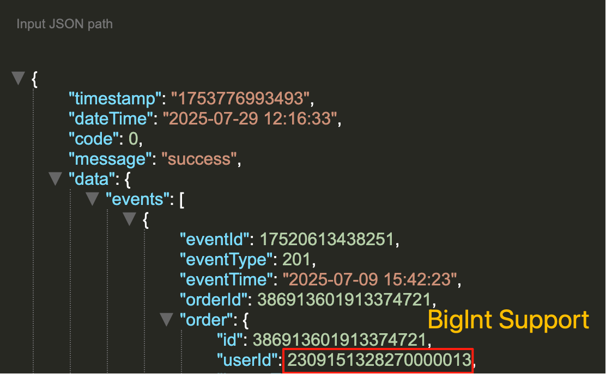
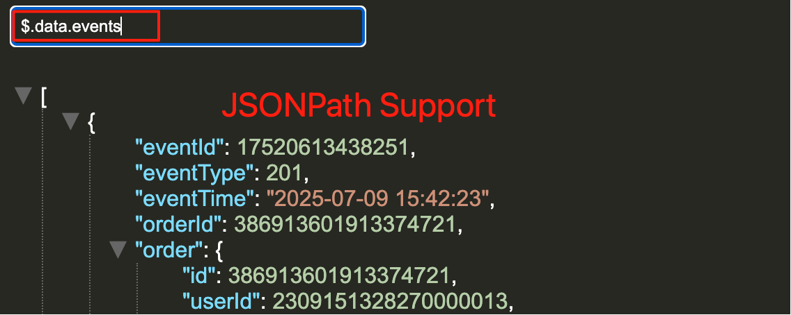

# Easy Json

```
A Json Chrome Extension,display json well,support BigInt,JsonPath.
```

## Features
1. Support for BigInt.
    
    As your know,json parsing does not support Number.MAX_SAFE_INTEGER number display, `EasyJson` support bigint correct display.
    
2. Support for JsonPath.

    Data nodes can be queried using json path expressions.
   

## Plugins

| Plugin Name  | Version | Site URL                                       | Original File                                                |
| ------------ | ------- | ---------------------------------------------- | ------------------------------------------------------------ |
| json-bigint  | 1.0.0   | https://www.npmjs.com/package/json-bigint      | [json-bigint/parse.js](https://raw.githubusercontent.com/sidorares/json-bigint/refs/heads/master/lib/parse.js) |
| bignumber.js | 9.3.1   | https://www.npmjs.com/package/bignumber.js     | [json-bigint/bignumber.js](https://raw.githubusercontent.com/MikeMcl/bignumber.js/refs/heads/main/bignumber.js) |
| jsonpath     | 0.11.2  | https://www.npmjs.com/package/JSONPath         | [json-path/jsonpath.js](https://raw.githubusercontent.com/JSONPath-Plus/JSONPath/refs/heads/main/dist/index-browser-umd.cjs) |
| jsonviewer   |         | https://github.com/song1024/json-format-viewer | [json-viewer](https://raw.githubusercontent.com/song1024/json-format-viewer/refs/heads/main/json-format-viewer.html) |

